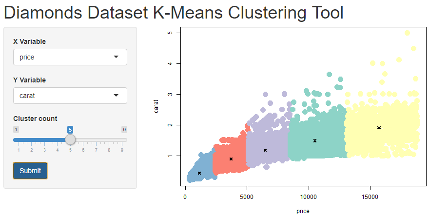

Week 4: Shiny Application and Reproducible Pitch
========================================================
author: Ingrid Tobar
date: 7/9/2019
autosize: true

Course Project Instructions
========================================================

- First, create a Shiny application and deploy it on Rstudio's servers.
- Second, use Slidify or Rstudio Presenter to prepare a reproducible pitch presentation about the application.

## Data

For this project I used the diamonds dataset. The diamonds dataset contains the prices and other attributes of almost 54,000 diamonds. For more details on this dataset please visit:

<https://ggplot2.tidyverse.org/reference/diamonds.html>.

Shiny Application
========================================================

The **Diamonds Dataset K-Means Clustering Tool** allows users to select two different variables of the diamonds dataset and apply k-means clustering to identify clusters in the data. The variables included in the k-means clustering tool are as follows:

- **price:**  Price in US dollars (\$326--\$18,823)
- **carat:**  Weight of the diamond (0.2--5.01)
- **x:**  Length in mm (0--10.74)
- **y:**  Width in mm (0--58.9)
- **z:**  Depth in mm (0--31.8)
- **depth:** Total depth percentage = z / mean(x, y) = 2 * z / (x + y) (43--79)
- **table:** Width of top of diamond relative to widest point (43--95)

How to Use the Application 
========================================================

The graphic above shows an example of clustering executed with the **Diamonds Dataset K-Means Clustering Tool**. 

It shows price on the x-axis and carat on the y-axis. The cluster count slider bar is set to 5 clusters. Once the user clicks on the **"Submit"** button the clustering graphic on the right is updated. 

The X and Y variables can be changed to any of the variables available: carat, depth, table, price, x, y, or z.

Diamonds Dataset K-Means Clustering Tool
========================================================

Feel free to use the **Diamonds Dataset K-Means Clustering Tool** using the following link:

<https://itobar.shinyapps.io/week4_kmeans_clustering_app/>.

