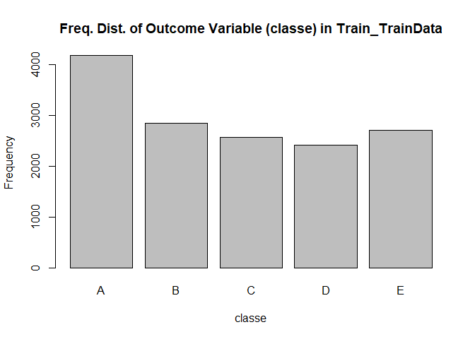
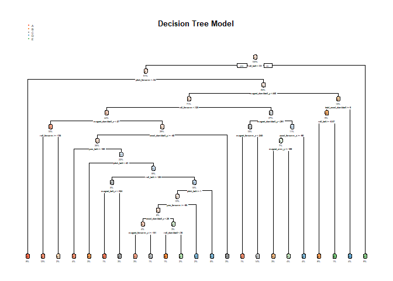
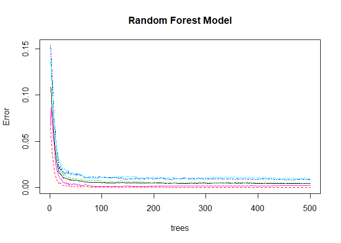

## 1. Project Goal and Methodology

One thing that people regularly do is quantify how much of a particular activity they do, but they rarely quantify how well they do it. In this project, I use data from accelerometers on the belt, forearm, arm, and dumbell of 6 participants to predict the manner in which the participants did the exercise. At the end, the best prediction model is used to predict 20 different test cases.


### Data

- TrainData: The training data for this project are available here:

https://d396qusza40orc.cloudfront.net/predmachlearn/pml-training.csv

- TestData: The test data for this project are available here:

https://d396qusza40orc.cloudfront.net/predmachlearn/pml-testing.csv

### Model Building

The outcome variable is 'classe', a factor variable with 5 levels. The study participants were asked to perform one set of 10 repetitions of unilateral dumbbell biceps curl in five different ways:

- Class A: Exactly according to the specification
- Class B: Throwing the elbows to the front
- Class C: Lifting the dumbbell only halfway
- Class D: Lowering the dumbbell only halfway
- Class E: Throwing the hips to the front

The models tested include Decision Tree and Random Forest. The model with the highest accuracy will be chosen as the final model. 

### Cross-validation

In order to perform cross-validation, the TrainData dataset is subsampled without replacement as follows:

- Train_TrainData: 75% of the Training dataset - Used to fit the models
- Test_TrainData: 25% of the Training dataset - Used to test the models

This process will help identify the most accurate model. That model will be tested on the TestData dataset.


### Expected Out of Sample Error

The expected value of the out-of-sample error corresponds to the expected number of missclassified observations/total observations in the TestData dataset, which is equivalent to 1-accuracy found from the cross-validation data set.

## 2. Code and Results

### Package Installation and Loading

Install and load the required packages for the analysis:


```r
#install.packages("caret"); install.packages("randomForest"); install.packages("rpart"); 
library(lattice); library(ggplot2); library(caret); library(randomForest); library(rpart); library(rpart.plot);
```

```
## randomForest 4.6-14
```

```
## Type rfNews() to see new features/changes/bug fixes.
```

```
## 
## Attaching package: 'randomForest'
```

```
## The following object is masked from 'package:ggplot2':
## 
##     margin
```

### Data Loading and Preparation

Set the seed to ensure reproducibility, load the data (previously downloaded from source), and remove NA and null values:


```r
set.seed(1234)
TrainData <- read.csv("pml-training.csv", na.strings=c("NA","#DIV/0!", ""))
TestData <- read.csv("pml-testing.csv", na.strings=c("NA","#DIV/0!", ""))
```

### Exploratory Analysis

Check dimensions, summary statistics (optional), and first 6 rows (optional) of TrainData:


```r
dim(TrainData)
```

```
## [1] 19622   160
```

```r
#summary(TrainData)
#head(TrainData)
```

Check dimensions, summary statistics (optional), and first 6 rows (optional) of TestData:


```r
dim(TestData)
```

```
## [1]  20 160
```

```r
#summary(TestData)
#head(TestData)
```

### Data Clean-Up

Delete any columns which contain only missing values and remove variables that are irrelevant to the model: user_name, raw_timestamp_part_1, raw_timestamp_part_,2 cvtd_timestamp, new_window, and  num_window (columns 1 to 7)


```r
TrainData <- TrainData[,colSums(is.na(TrainData)) == 0]
TestData <- TestData[,colSums(is.na(TestData)) == 0]
TrainData   <- TrainData[,-c(1:7)]
TestData <- TestData[,-c(1:7)]
```

### Subsampling TrainData 

Subsample TrainData dataset without replacement as follows:

- Train_TrainData: 75% of the Training dataset - Used to fit the models
- Test_TrainData: 25% of the Training dataset - Used to test the models


```r
Partition_TrainData <- createDataPartition(y=TrainData$classe, p=0.75, list=FALSE)
Train_TrainData <- TrainData[Partition_TrainData, ]
Test_TrainData <- TrainData[-Partition_TrainData, ]
```

### Outcome Variable Frequency Distribution

Plot the frequency distribution of the outcome variable ("classe") in the Train_TrainData dataset:


```r
plot(Train_TrainData$classe, col="gray", main="Freq. Dist. of Outcome Variable (classe) in Train_TrainData", xlab="classe", ylab="Frequency")
```

<!-- -->

This plot shows that Outcome Variable A is the most frequent, whereas Outome Variable D is the least frequent. However, all the outcome variables are within the same order of magnitude.

## 3. Model Building and Evaluation

### Build Decision Tree Model

Build a Decision Tree model with the Train_TrainData dataset and plot the Decision Tree


```r
Model_DecTree <- rpart(classe ~ ., data=Train_TrainData, method="class")
Predict_DecTree <- predict(Model_DecTree, Test_TrainData, type = "class")
rpart.plot(Model_DecTree, main="Decision Tree Model", extra=100, under=TRUE, faclen=0)
```

<!-- -->

### Decision Tree Model Testing

Test the Decision Tree model on the Test_TrainData dataset and output the Confusion Matrix and Statistics:


```r
DecTree_ConfMatrix <- confusionMatrix(Predict_DecTree, Test_TrainData$classe)
DecTree_ConfMatrix
```

```
## Confusion Matrix and Statistics
## 
##           Reference
## Prediction    A    B    C    D    E
##          A 1251  149   15   61   17
##          B   38  572   75   60   75
##          C   39  117  696  117  122
##          D   49   58   51  508   58
##          E   18   53   18   58  629
## 
## Overall Statistics
##                                           
##                Accuracy : 0.7455          
##                  95% CI : (0.7331, 0.7577)
##     No Information Rate : 0.2845          
##     P-Value [Acc > NIR] : < 2.2e-16       
##                                           
##                   Kappa : 0.6774          
##                                           
##  Mcnemar's Test P-Value : < 2.2e-16       
## 
## Statistics by Class:
## 
##                      Class: A Class: B Class: C Class: D Class: E
## Sensitivity            0.8968   0.6027   0.8140   0.6318   0.6981
## Specificity            0.9310   0.9373   0.9024   0.9473   0.9633
## Pos Pred Value         0.8379   0.6976   0.6379   0.7017   0.8106
## Neg Pred Value         0.9578   0.9077   0.9583   0.9292   0.9341
## Prevalence             0.2845   0.1935   0.1743   0.1639   0.1837
## Detection Rate         0.2551   0.1166   0.1419   0.1036   0.1283
## Detection Prevalence   0.3044   0.1672   0.2225   0.1476   0.1582
## Balanced Accuracy      0.9139   0.7700   0.8582   0.7896   0.8307
```

The Decision Tree model has an accuracy of **74.55%**

### Build Random Forest Model

Build a Random Forest model with the Train_TrainData dataset and plot the Random Forest model


```r
Model_RandomForest <- randomForest(classe ~ ., data=Train_TrainData, method="class")
Predict_RandomForest <- predict(Model_RandomForest, Test_TrainData, type = "class")
plot(Model_RandomForest, main="Random Forest Model")
```

<!-- -->

### Random Forest Model Testing

Test the Random Forest model on the Test_TrainData dataset and output the Confusion Matrix and Statistics:


```r
RanForest_ConfMatrix <- confusionMatrix(Predict_RandomForest, Test_TrainData$classe)
RanForest_ConfMatrix
```

```
## Confusion Matrix and Statistics
## 
##           Reference
## Prediction    A    B    C    D    E
##          A 1395    4    0    0    0
##          B    0  944    8    0    0
##          C    0    1  847    6    0
##          D    0    0    0  798    1
##          E    0    0    0    0  900
## 
## Overall Statistics
##                                           
##                Accuracy : 0.9959          
##                  95% CI : (0.9937, 0.9975)
##     No Information Rate : 0.2845          
##     P-Value [Acc > NIR] : < 2.2e-16       
##                                           
##                   Kappa : 0.9948          
##                                           
##  Mcnemar's Test P-Value : NA              
## 
## Statistics by Class:
## 
##                      Class: A Class: B Class: C Class: D Class: E
## Sensitivity            1.0000   0.9947   0.9906   0.9925   0.9989
## Specificity            0.9989   0.9980   0.9983   0.9998   1.0000
## Pos Pred Value         0.9971   0.9916   0.9918   0.9987   1.0000
## Neg Pred Value         1.0000   0.9987   0.9980   0.9985   0.9998
## Prevalence             0.2845   0.1935   0.1743   0.1639   0.1837
## Detection Rate         0.2845   0.1925   0.1727   0.1627   0.1835
## Detection Prevalence   0.2853   0.1941   0.1741   0.1629   0.1835
## Balanced Accuracy      0.9994   0.9964   0.9945   0.9961   0.9994
```

The Random Forest model has an accuracy of **99.59%**


## 4. Model Selection and Predictions

### Select Model by Accuracy

The accuracy of the Random Forest model, **99.59%** is higher than the accuracy achieved with the Decision Tree model, **74.55%**, therefore the **Random Forest** model is chosen to predict 20 different test cases. 


### Run Model and Predict on Test Data

The Random Forest model is applied to predict results on the 20 observations found in the TestData dataset. The results are as follows:


```r
FinalPredict_RandomForest <- predict(Model_RandomForest, TestData, type = "class")
FinalPredict_RandomForest
```

```
##  1  2  3  4  5  6  7  8  9 10 11 12 13 14 15 16 17 18 19 20 
##  B  A  B  A  A  E  D  B  A  A  B  C  B  A  E  E  A  B  B  B 
## Levels: A B C D E
```
